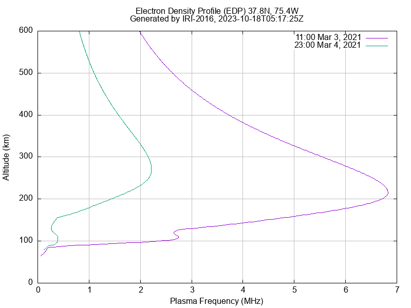
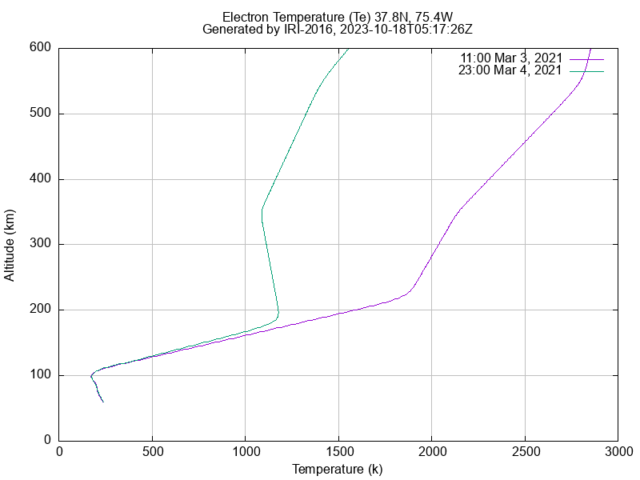
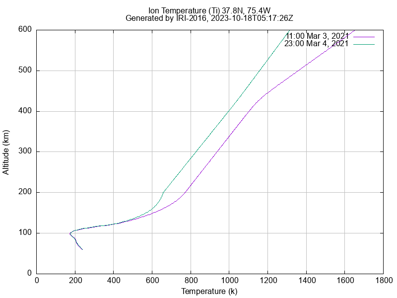
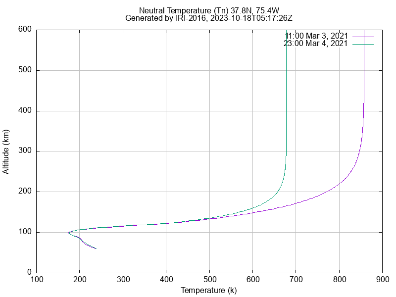

# IRI (International Reference Ionosphere) EDP (Electron Density Profile) 

## Assessment

> Assessment IRI EDP: Create a C-based modeling and simulation program that drive IRI model Fortran code. The code should capture and generate vertical EDP (Electron Density Profile) for a given time and location of interest.  

- time of interest: Mar 3 2021 UT 11:00:00 and Mar 4, 2021 UT 23:00:00 
- location of interest: Lat 37.8N and Lon 75.4W 
- Assessment Criteria:
	- Create a simple Makefile that can compile iri2016 (http://irimodel.org) and generate a shared object/library 
	- Write a C-program that links with the shared object created and create all data needed for step 3) 
	- Use gnuplot (www.gnuplot.info) or other similar C-based plotting tools to generate plots of EDP parameters using the shared objective created in step 1.
	- alternatively, use F2PY (https://www.numfys.net/howto/F2PY/) and Python to create EDP plots using the shared object created in step 1. (Although C-based plotting is the preferred solution)
	- Furnish instructions/documentation, etc. on how to run the code and lesson/insights learned by doing this exercise. 

## How to run

The script `tasks.sh` contains all the commands needed to reproduce the results. Invoke a command by running `./tasks.sh <command>`. Each command is simply a bash function, so you can easily inspect what a command is doing in the script.

```bash
# Download the IRI2016 model code and data files and locate them under ./lib/iri16/
./tasks.sh download_iri16

# Build the IRI2016 model shared lib. This outputs the shared library `./bin/libiri16.so` and copies data
# files required by the model to the `./bin` directory.
./tasks.sh build_iri_lib

# Compile the C program that calls the IRI2016 model. This outputs the executable `./bin/run_iri`.
./tasks.sh build_iri_edp

# OR - Build both at once
./tasks.sh build

# Run the C program to generate the IRI output data for the requested time and locations.
# This generates 2 csv files in the ./csv directory.
# - ./csv/t1.csv: data for March 3, 2021 UT 11:00:00
# - ./csv/t2.csv: data for March 4, 2021 UT 23:00:00
# Note: the following command is run from the `iri_edp` project directory. The command takes care of
# setting the working directory to the `./bin` directory so the model has access to it's data files.
./tasks.sh run

# Generate the plots from the csv files using gnuplot. Both time and location data points are plotted together.
# This generates plots in the ./plots directory. Plots for EDP and temperatures are generated.
./tasks.sh plot_all
```

## Plots






## Discussion

- Correctly handling the interop call to `iri_sub` from C to Fortran took some trial and error. Initially, I tried passing the JF logical array that holds the IRI model options as a bool (from `stdbool.h`) array. This compiled and ran but caused `iri_sub` output to be garbage. Eventually I traced the problem to the array type and found it needed to be an `int` array.
	- Because of this I ended up learning a lot more about the IRI model's options and outputs by reading the code documentation when trying to locate where I was going wrong.
- I noticed the EDP plots are showing altitude vs plasma frequency, but the IRI model outputs electron density as $\frac{1}{m^3}$. This lead me to read more about ionosphere modeling and found there is a critical frequency that is directly related to electron density by the formula $f_{crit} = 9 * \sqrt{n_e}$. This frequency was then converted to MHz in the run_iri program for the plot.